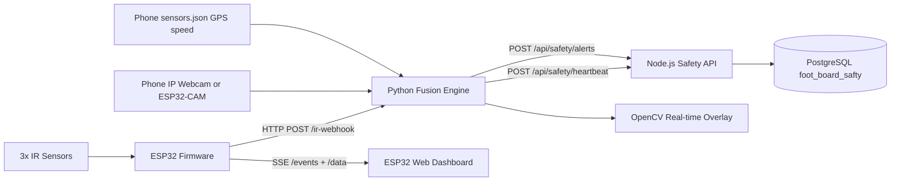

# SISURAKSHA Footboard Safety Monitoring Module
## Full Technical Specification (Implementation-Aligned)

Project: SISURAKSHA - Intelligent Child Safety Platform for School Buses  
Component: Footboard occupancy detection, risk classification, and alerting  
Author context: Pinto R.I.S.R (IT22610102)  
Document status: Rewritten and aligned to current codebase  
Last verification date: 2026-04-25

---

## 1. Scope and objective

This document describes the full Footboard Safety module from hardware input to database persistence. It covers:

1. ESP32 + IR sensor firmware behavior.
2. Python AI + IR fusion pipeline.
3. GPS speed integration and risk logic.
4. Node.js API integration and model orchestration.
5. Alert payloads, formulas, timing, setup, and diagnostics.

The goal is an implementation-level specification that can be used to build, run, test, and maintain the module end to end.

---

## 2. Source of truth artifacts

Primary implementation files used for this specification:

1. `footboard safety/riyabeth_pro_safety.py` - main Python runtime (AI, fusion, UI, webhook, server calls).
2. `footboard safety/requirements.txt` - Python dependency pinning.
3. `sisuraksha_ir_final/sisuraksha_ir_final.ino` - ESP32 IR firmware + web dashboard + webhook push.
4. `shared_network_config.py` - central network and endpoint configuration loader.
5. `sisuraksha_network.env` - network configuration values.
6. `server/routes/safetyRoutes.js` - Footboard API endpoints.
7. `server/controllers/safetyController.js` - alert persistence, heartbeat status, process start/stop logic.
8. `server/index.js` - route mount under `/api/safety`.

---

## 3. End-to-end architecture



Core safety fusion principle:

$$
\text{footboard\_occupied} = \text{yolo\_occupied} \lor \text{ir\_occupied}
$$

---

## 4. Hardware subsystem (IR + ESP32)

### 4.1 Bill of materials

1. ESP32 development board.
2. 3x E18-D80NK style IR proximity sensors (digital output mode).
3. 5V / 3.3V compatible power and common ground wiring.
4. Wi-Fi network connectivity for webhook and dashboard.

### 4.2 Sensor to pin mapping

From `sisuraksha_ir_final/sisuraksha_ir_final.ino`:

1. Step 1 (top): GPIO 27 (`IR_STEP1`).
2. Step 2 (middle): GPIO 26 (`IR_STEP2`).
3. Step 3 (bottom / highest hazard): GPIO 25 (`IR_STEP3`).

### 4.3 Compile-time sensor enable switches

Current firmware switches:

1. `ENABLE_STEP1 false`
2. `ENABLE_STEP2 true`
3. `ENABLE_STEP3 false`

This means the current flashed profile is a one-sensor test profile (only Step 2 active). For full production sensing, all three should be enabled.

### 4.4 Signal polarity and input mode

Current logic:

1. `DETECTED HIGH`
2. `IR_INPUT_MODE INPUT_PULLDOWN`

Interpretation: HIGH means object detected (occupied).

If sensor hardware behaves inverted, firmware comments indicate switching to LOW + INPUT_PULLUP.

---

## 5. ESP32 firmware design details

### 5.1 Firmware libraries

1. `WiFi.h`
2. `ESPmDNS.h`
3. `AsyncTCP.h`
4. `ESPAsyncWebServer.h`
5. `HTTPClient.h`

### 5.2 Runtime roles

The firmware does all of the following:

1. Reads IR sensors continuously.
2. Streams live states to browser clients via SSE (`/events`).
3. Exposes state snapshot endpoint (`/data`).
4. Pushes changes to Python webhook (`/ir-webhook`).
5. Hosts local HTML dashboard on root route (`/`).

### 5.3 Web server routes

1. `GET /` -> returns embedded HTML dashboard.
2. `GET /data` -> JSON `{s1,s2,s3}`.
3. SSE `events` at `/events` with event type `s`.

### 5.4 Sensor read and JSON build

Sensor read function:

1. If sensor is disabled with `ENABLE_STEPx = false`, value is forced false.
2. Otherwise, raw read is `digitalRead(pin) == DETECTED`.

JSON sent to dashboard and webhook includes:

1. `s1` bool
2. `s2` bool
3. `s3` bool

Webhook payload additionally includes:

1. `risk` int
2. `ts` milliseconds since boot (`millis()`)

### 5.5 Firmware risk encoding formula

Firmware logic sets risk as highest occupied step:

$$
r = \max\left(1\cdot \mathbb{1}_{s_1},\; 2\cdot \mathbb{1}_{s_2},\; 3\cdot \mathbb{1}_{s_3}\right)
$$

Equivalent implementation order:

1. Start `risk = 0`
2. If `s1`, set `risk = 1`
3. If `s2`, overwrite to `risk = 2`
4. If `s3`, overwrite to `risk = 3`

Therefore, if multiple sensors trigger simultaneously, the bottom-step hazard dominates.

### 5.6 Timing and task model

`broadcastTask` (pinned to Core 0) loops every 100 ms:

$$
f_{broadcast} = \frac{1}{0.1} = 10\;\text{Hz}
$$

Actions per cycle:

1. Read sensor states.
2. Push SSE event to clients (if connected).
3. POST webhook only if state changed.

HTTP timeout for webhook POST is 500 ms to avoid long blocking.

### 5.7 Network resilience

1. Wi-Fi connect retries up to 30 attempts (500 ms each) in setup.
2. If setup cannot connect, board restarts.
3. Loop watchdog checks Wi-Fi every 5 s and calls `WiFi.reconnect()` if dropped.
4. mDNS host: `sisuraksha-footboard.local`.

---

## 6. Python fusion runtime (`riyabeth_pro_safety.py`)

### 6.1 Python dependencies (pinned)

From `footboard safety/requirements.txt`:

1. `flask==3.1.0`
2. `opencv-python==4.10.0.84`
3. `requests==2.33.1`
4. `torch==2.11.0`
5. `ultralytics==8.4.36`

### 6.2 Configuration resolution hierarchy

`shared_network_config.py` resolves configuration in this order:

1. hardcoded defaults
2. values from `sisuraksha_network.env`
3. OS environment variables
4. explicit overrides passed to loader

This is effectively:

$$
Config = Defaults \oplus EnvFile \oplus ProcessEnv \oplus Overrides
$$

Where later sources override earlier ones.

### 6.3 Main runtime arguments

Supported CLI arguments and defaults:

1. `--driver_id` (from `DRIVER_ID`)
2. `--server_url` (from `FOOTBOARD_SERVER_URL`)
3. `--phone_ip` (from `PHONE_IP`)
4. `--esp32_cam_ip` (from `ESP32_CAM_IP`)
5. `--camera_source` in `{phone, esp32cam}` (from `FOOTBOARD_CAMERA_SOURCE`)
6. `--camera_url` custom full URL override
7. `--esp_ip` (from `ESP32_IR_IP`, currently informational in logs)
8. `--webhook_port` (from `FOOTBOARD_WEBHOOK_PORT`, default 5001)
9. `--display_width` default 640
10. `--display_height` default 480
11. `--ai_imgsz` default 416
12. `--ai_conf` default 0.25
13. `--ai_interval` default 0.12 s, clamped with lower bound 0.03 s

AI interval clamp:

$$
\Delta t_{AI} = \max(0.03, \text{user\_ai\_interval})
$$

### 6.4 Input URL construction

1. Phone video URL: `http://<PHONE_IP>/video`
2. Phone sensors URL: `http://<PHONE_IP>/sensors.json`
3. ESP32-CAM stream URL: `http://<ESP32_CAM_IP>/stream`

`--camera_url` bypasses source selection and is used directly.

### 6.5 Concurrency model

Runtime threads/tasks:

1. Main thread: frame fusion + overlay drawing + alert dispatch + window display.
2. Camera thread (`FastCamera.update`): continuous frame fetch/reconnect logic.
3. AI thread (`run_ai_inference`): decoupled YOLO inference.
4. GPS thread (`update_sensors`): poll speed every 500 ms.
5. Flask webhook thread (`run_webhook_server`): receive ESP32 pushes.
6. Heartbeat thread (`send_heartbeat`): post to server every 5 s.

Shared state synchronization:

1. `ir_state_lock` protects IR dictionary.
2. `ai_state_lock` protects AI detection state.
3. camera frame lock protects latest frame buffer.

### 6.6 Camera ingestion implementation

Two camera modes are supported:

1. FFMPEG `VideoCapture` path (typical phone `/video`).
2. Manual MJPEG parser path (esp32cam `/stream` or URL containing `/stream`).

FFMPEG path settings:

1. `CAP_PROP_BUFFERSIZE = 1` (latest-frame preference).
2. `MJPG` FOURCC.
3. open timeout 3000 ms if supported.
4. read timeout 1000 ms if supported.

If stream appears stale for more than 2 s, capture is reopened.

Manual MJPEG parser behavior:

1. HTTP streaming with chunk size 2048 bytes.
2. Detect JPEG frame boundaries using markers `FFD8` and `FFD9`.
3. Decode most recent complete JPEG and publish frame.
4. Reconnect after stream errors with 500 ms backoff.

### 6.7 GPS speed pipeline

Polling every 500 ms:

$$
v_{km/h} = v_{m/s} \times 3.6
$$

Source key path: `gps_speed.data[-1][1][0]`.

On fetch/parse failure, speed is set to 0.0 (safe default).

### 6.8 Webhook receiver (`/ir-webhook`)

The Flask endpoint accepts JSON booleans and flexible truthy formats via `parse_bool`.

Accepted truthy values include:

1. bool `true`
2. numeric nonzero
3. strings: `1,true,yes,on,occupied,blocked`

IR state object maintained in memory:

1. `s1`
2. `s2`
3. `s3`
4. `online` (set true after valid webhook)

IR webhook immediate alert cooldown:

$$
\Delta t_{IRWebhook} = 0.8\;s
$$

### 6.9 AI inference pipeline

1. Model loaded from `best.pt`.
2. `model.fuse()` is called for optimized inference.
3. Device selection: CUDA GPU if available, else CPU.
4. FP16 enabled only on CUDA.
5. On CPU, torch threads are capped to 1..4.

Inference call parameters:

1. `imgsz = AI_IMGSZ` (default 416)
2. `conf = AI_CONF` (default 0.25)
3. `iou = 0.45`
4. `verbose = false`

Detection filtering keeps only labels:

1. `Danger`
2. `Warning`

YOLO occupancy:

$$
\text{yolo\_occupied} = \exists b \in \mathcal{B}^+,
\quad \mathcal{B}^+ = \{b \mid label(b) \in \{Danger, Warning\}\}
$$

Maximum AI confidence:

$$
c_{AI} = \max_{b \in \mathcal{B}^+} conf(b)
$$

AI FPS estimate:

$$
fps_{AI} = \frac{1}{\max(\Delta t_{infer}, 0.001)}
$$

### 6.10 Sensor fusion and risk logic

IR occupancy and danger flags:

$$
\text{ir\_occupied} = s_1 \lor s_2 \lor s_3
$$

$$
\text{ir\_danger} = s_3
$$

Combined occupancy:

$$
\text{footboard\_occupied} = \text{yolo\_occupied} \lor \text{ir\_occupied}
$$

Bus motion threshold:

$$
\text{is\_moving} = (v_{km/h} > 5.0)
$$

State classification used in the main loop:

$$
status =
\begin{cases}
CRITICAL & \text{if } (\text{footboard\_occupied} \land \text{is\_moving}) \lor \text{ir\_danger} \\
WARNING & \text{if } \text{footboard\_occupied} \land \neg\text{is\_moving} \\
SAFE & \text{otherwise}
\end{cases}
$$

Detection source resolution:

1. `AI + IR Sensors` if both true.
2. `AI Vision Only` if only AI true.
3. `IR Sensors Only (Top/Mid/Bottom Step)` if only IR true.
4. `Safe` otherwise.

Confidence assignment:

$$
c =
\begin{cases}
1.0 & \text{if IR only or AI+IR} \\
c_{AI} & \text{if AI only} \\
0.0 & \text{if safe}
\end{cases}
$$

### 6.11 Alert channels and throttling

There are two alert emit paths:

1. Immediate IR webhook-change path (`send_ir_webhook_alert`) with 0.8 s cooldown.
2. Main fusion loop path (`send_alert`) with 2 s cooldown.

Main loop cooldown:

$$
\Delta t_{mainAlert} = 2\;s
$$

Send rule:

$$
\text{send at } t \iff (t - t_{last}) > \Delta t
$$

Webhook path status logic:

$$
status_{webhook} =
\begin{cases}
SAFE & \text{if } \neg\text{ir\_occupied} \\
CRITICAL & \text{if } s_3 \lor \text{is\_moving} \lor (risk\ge3) \\
WARNING & \text{otherwise}
\end{cases}
$$

### 6.12 UI rendering details

1. OpenCV window title: `RiyaNeth: AI + GPS Integrated Monitor`.
2. Top status banner color:
   - Red `(0,0,255)` for CRITICAL
   - Yellow `(0,255,255)` for WARNING
   - Green `(0,255,0)` for SAFE
3. Overlays include IR online state, GPS activity, camera FPS, AI FPS.
4. Camera stale warning shown if frame age exceeds 1.0 s.
5. Exit key is `q`.

---

## 7. Server-side integration (`/api/safety`)

### 7.1 Route mount and base path

`server/index.js` mounts safety routes under:

1. `/api/safety`

### 7.2 Endpoint catalog

From `server/routes/safetyRoutes.js`:

1. `POST /heartbeat`
2. `GET /status`
3. `POST /toggle`
4. `POST /model/start`
5. `POST /model/stop`
6. `GET /model/status`
7. `POST /alerts`
8. `GET /alerts`
9. `GET /alerts/critical`
10. `GET /stats`

### 7.3 Python process orchestration

`startModel` in `safetyController.js`:

1. Resolves Python interpreter from candidate paths:
   - `footboard safety/.venv/Scripts/python.exe`
   - `footboard safety/venv/Scripts/python.exe`
   - root `.venv/Scripts/python.exe`
2. Accepts override env: `FOOTBOARD_PYTHON`.
3. Spawns `riyabeth_pro_safety.py` with driver and camera args.
4. Startup grace window: 800 ms before confirming success.

### 7.4 Heartbeat status logic

For a driver, system status is online when last heartbeat age is below 10 s:

$$
status =
\begin{cases}
online & \text{if } (now - t_{heartbeat}) < 10000\;ms \\
offline & \text{otherwise}
\end{cases}
$$

### 7.5 Alert normalization and persistence

If `POST /alerts` receives hardware shape (`s1/s2/s3`), server normalizes into textual alert fields.

Alert insert target table is:

1. `foot_board_safty` (spelling in code is intentional and must match DB).

Fields inserted by controller:

1. `driver_id`
2. `timestamp`
3. `alert_type`
4. `status`
5. `speed`
6. `confidence`
7. `message`
8. `sound`

`GET /alerts` and `GET /stats` require `created_at` for sorting and time filtering.

---

## 8. Data contracts

### 8.1 ESP32 -> Python webhook payload

```json
{
  "s1": true,
  "s2": false,
  "s3": true,
  "risk": 3,
  "ts": 12345678
}
```

### 8.2 Python -> Node heartbeat payload

```json
{
  "driver_id": "<uuid-or-default>"
}
```

### 8.3 Python -> Node alert payload

```json
{
  "driver_id": "<uuid-or-default>",
  "timestamp": "2026-04-25T12:34:56.000000",
  "alert_type": "AI + IR Sensors",
  "status": "CRITICAL",
  "speed": 18.2,
  "confidence": 1.0,
  "message": "Footboard occupied [S3-Bottom] at 18.2 km/h via AI + IR Sensors. Stop immediately.",
  "sound": true,
  "detection_class": "AI + IR Sensors"
}
```

### 8.4 Footboard table schema status

No migration file for `foot_board_safty` is present in this repository. Schema must exist in database externally. Based on controller usage, minimum required columns are:

1. `driver_id`
2. `timestamp`
3. `alert_type`
4. `status`
5. `speed`
6. `confidence`
7. `message`
8. `sound`
9. `created_at`

Recommended inferred DDL for reference:

```sql
CREATE TABLE IF NOT EXISTS foot_board_safty (
  id BIGSERIAL PRIMARY KEY,
  driver_id TEXT,
  timestamp TIMESTAMPTZ NOT NULL,
  alert_type TEXT NOT NULL,
  status TEXT NOT NULL,
  speed DOUBLE PRECISION NOT NULL DEFAULT 0,
  confidence DOUBLE PRECISION NOT NULL DEFAULT 0,
  message TEXT NOT NULL,
  sound BOOLEAN NOT NULL DEFAULT false,
  created_at TIMESTAMPTZ NOT NULL DEFAULT NOW()
);
```

---

## 9. Build and deployment procedure (top to bottom)

### 9.1 Prerequisites

1. ESP32 board support installed in Arduino IDE.
2. Arduino libraries: AsyncTCP, ESPAsyncWebServer.
3. Python 3.10+ recommended.
4. Node.js backend running with `/api/safety` routes.
5. PostgreSQL table `foot_board_safty` provisioned.
6. Camera source available (phone IP Webcam or ESP32-CAM).

### 9.2 Backend startup

From `server/.env`, ensure port aligns with client config (`PORT=5000` in current setup).

```bash
cd server
npm install
npm run dev
```

### 9.3 Python environment setup

```bash
cd "footboard safety"
python -m venv .venv
.venv\Scripts\activate
pip install -r requirements.txt
```

### 9.4 Firmware configuration and flash

Edit `sisuraksha_ir_final/sisuraksha_ir_final.ino`:

1. Set Wi-Fi credentials.
2. Set `FOOTBOARD_WEBHOOK_URL` to host running Python webhook (default port 5001).
3. Set sensor enable flags to match actual wiring.
4. Confirm signal polarity macros.

Compile and upload to ESP32.

### 9.5 Run Python fusion engine

```bash
cd "footboard safety"
.venv\Scripts\python riyabeth_pro_safety.py
```

Optional explicit parameters:

```bash
.venv\Scripts\python riyabeth_pro_safety.py --camera_source phone --phone_ip 10.60.136.249:8080 --server_url http://localhost:5000/api/safety
```

### 9.6 Validation sequence

1. Open ESP32 dashboard at `http://<esp32_ip>/` and confirm step state updates.
2. Confirm Python log shows webhook listener started on configured port.
3. Trigger sensor and verify Flask `/ir-webhook` logs state transitions.
4. Confirm Node receives `POST /alerts` and inserts DB rows.
5. Confirm OpenCV window shows overlay status and FPS metrics.

---

## 10. Calibration and tuning guide

### 10.1 Sensor polarity tuning

If false positives or inverted readings are seen:

1. Toggle `DETECTED` between `HIGH` and `LOW`.
2. Match input mode (`INPUT_PULLDOWN` vs `INPUT_PULLUP`).
3. Validate each sensor individually with only one `ENABLE_STEPx=true`.

### 10.2 AI performance and sensitivity tuning

1. `--ai_conf`: lower increases recall, higher reduces false positives.
2. `--ai_imgsz`: higher may improve accuracy but increases latency.
3. `--ai_interval`: lower gives faster updates but raises compute load.

### 10.3 Risk threshold tuning

Current movement threshold:

$$
v_{threshold} = 5.0\;km/h
$$

Increasing threshold reduces CRITICAL alerts at low speeds; decreasing threshold makes system stricter.

---

## 11. Test assets and diagnostics

### 11.1 Connection test script

`footboard safety/test_connection.py` validates:

1. `GET /status`
2. `POST /heartbeat`
3. `POST /alerts`
4. `GET /alerts`

Run:

```bash
cd "footboard safety"
.venv\Scripts\python test_connection.py
```

### 11.2 Heartbeat soak test

`footboard safety/heartbeat_test.py` sends periodic heartbeats and synthetic alerts.

Run:

```bash
cd "footboard safety"
.venv\Scripts\python heartbeat_test.py
```

### 11.3 Runtime indicators

Useful runtime logs:

1. Python startup prints selected camera source and URLs.
2. `[ESP32 PUSH] IR State` confirms webhook reception.
3. `[OK] Alert sent` confirms accepted server alert writes.
4. `CAMERA STALE` overlay indicates camera latency/dead stream.

---

## 12. Failure behavior and safety posture

Failure handling implemented today:

1. Camera failure: AI may degrade, IR path still active.
2. GPS failure: speed forced to 0.0 (safe-side severity reduction).
3. ESP32 disconnect: IR online flag remains false, AI still active.
4. Server/API unavailable: local UI continues, alert POSTs fail gracefully.
5. AI inference exceptions: loop catches and continues.

Safety design bias is recall-first (OR fusion) to reduce false negatives in child hazard detection.

---

## 13. Security and operations notes

1. ESP32 sketch currently stores Wi-Fi SSID/password in source; move to secure provisioning for production.
2. Server `.env` contains sensitive credentials and keys; never commit real secrets.
3. Keep module services on a trusted LAN/VPN; current webhook path has no auth token.
4. Consider TLS and signed payloads for cross-network deployment.

---

## 14. Known gaps and recommended next improvements

1. Add migration SQL for `foot_board_safty` to eliminate external schema dependency.
2. Add auth or shared secret on `/ir-webhook` and `/api/safety/alerts` ingest paths.
3. Add deduplication strategy to coordinate dual alert channels (IR immediate + fused main loop).
4. Externalize firmware credentials and URLs into provisioning workflow.
5. Add structured health endpoint in Python runtime (camera, AI, GPS, IR heartbeat).
6. Add unit/integration tests for fusion truth table and cooldown behavior.

---

## 15. Formula summary

Core equations used across module:

1. GPS conversion:

$$
v_{km/h} = v_{m/s} \times 3.6
$$

2. Firmware risk:

$$
r = \max(1\cdot \mathbb{1}_{s_1}, 2\cdot \mathbb{1}_{s_2}, 3\cdot \mathbb{1}_{s_3})
$$

3. IR occupancy:

$$
\text{ir\_occupied} = s_1 \lor s_2 \lor s_3
$$

4. Combined occupancy:

$$
\text{footboard\_occupied} = \text{yolo\_occupied} \lor \text{ir\_occupied}
$$

5. Motion predicate:

$$
\text{is\_moving} = (v_{km/h} > 5.0)
$$

6. Main risk state:

$$
status =
\begin{cases}
CRITICAL & (\text{footboard\_occupied} \land \text{is\_moving}) \lor s_3 \\
WARNING & \text{footboard\_occupied} \land \neg\text{is\_moving} \\
SAFE & \text{otherwise}
\end{cases}
$$

7. Alert cooldown gating:

$$
\text{send} \iff (t - t_{last}) > \Delta t
$$

Where:

1. `Delta t = 2.0 s` for fused loop alerts.
2. `Delta t = 0.8 s` for immediate webhook-change alerts.

---

This specification now reflects the current source implementation and can be used as the canonical technical document for the footboard safety module.